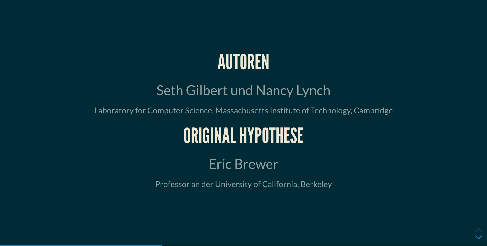

# Notizen

***Modul:***\
_SEMA_INF, Seminararbeit, INF-P-AT002, BE-Sa-1, FS22_

***Dozent:***\
_Prof. Dr. Zimmermann Heinrich_

***Autor:***\
_Oliver Bucher_

Brewer -> Eric Brewer, der 2000 die Hypothese (CAP-Theorem) aufgestellt hatte

Conjecture -> Hypothese

CAP-Theorem -> War Inhalt des Moduls Datenbanksysteme

Eric Brewer hat im Jahre 2000 das CAP-Theorem aufgestellt. Eine Hypothese, die besagt, dass
kein
Webservice alle drei Merkmale (Konsistenz, Verfügbarkeit, Partitionstoleranz) gleichzeitig
erfüllen kann.

Sie beweisen dies im Kontext eines asynchronen Netzwerkes (jeder Node im Netzwerk handelt
unabhängig von anderen und reagiert eigenständig auf erhaltene Nachrichten). Dennoch geben
sie
je ein Beispiel, wie je zwei der drei Eigenschaften erreicht werden können.

Als nächstes erklären die Autoren ein mögliches, schwächeres CAP-Theorem in einem teilweise
synchonisierten Model, in welchem die Konsistenz nicht immer gewährleistet ist, jedoch die
einzelnen Nodes regelmässig synchronisiert werden (im Falle von verloren gegangenen
Nachrichten). Ist also Konsistent mit einem Zeitverzug.

Seth Gilbert scheint aktuell an der National University of Singapore zu dozieren. Gemäss
Google Scholar hat er ca. 100 Papers erfasst. Viele davon als primärer Autor.

Nancy Lynch ist aktuell weiterhin am MIT beschäftigt. Sie hat gemäss Google Scholar hunderte
von Papers geschreiben (ich habe bei 500 aufgehört zu Zählen).
Die beiden Autoren haben 10 Jahre nach diesem Paper eingereicht unter dem Titel "Perspectives
on the CAP Theorem" im Jahre 2012.

Eric Brewer ist gemäss seinem LinkedIn Profil aktuell in der Position des VP Infrastructure
bei Google (seit 11 Jahren). Ausserdem ist er nach wie vor Professor an der Universität of
California in Berkley (seit 28 Jahren). Er selber hat ein Paper mit dem Titel "CAP Twelve
Years Later: How the 'Rules' Have Changed" im Jahr 2012 im Computer Magazin veröffentlicht.

Die Darstellung ist auf das nötigste reduziert. Es erinnert mich stark an Mathematik-Bücher,
die wir in den vergangenen Semestern gelesen haben.

Die Gliederung ist klar, nummeriert und die Überschriften sind sehr aussagekräftig. Fussnoten
werden oft und ausführlich verwendet.

Am Ende jedes "Proofs" wurde ein schwarzes Quadrat platziert. Dessen Bedeutung ist mir auch
nach einer kurzen Internetrecherche noch immer unklar.

Die Autoren definieren zuerst Begriffe wie "Atomic Data Objects", "Available Data Objects",
"Partition Tolerance".

Im Anschluss beweisen sie erstes Theorem (asynchrones Netzwerk) mithilfe logische
Schlussfolgerung durch einen Widerspruch. Ein sehr ähnliches, zweites Theorem (teilweise
synchronisiertes Netzwerk) wird mitderselben Methodik bewiesen.

Um eine mögliche Lösung des CAP-Theorem anzubieten, lockern die Autoren die Anforderung von
Konsistenz zu "Konsistenz mit Zeitverzug", welches in einem teilweise synchonisiertem
Netzwerk
umsetzbar ist.

Zum Schluss wird analog zum Abstract nochmals der Inhalt grob zusammengefasst. Ausserdem
wird
darauf hingewiesen, was in der Realität meist eingesetzt bzw. angestreben wird. Der letzte
Satz
versucht für weitere Forschung zu animieren.

Eine Aufzeichnung des Vortrags von Eric Brewer, auf dessen Aussagen dieses Paper basiert,
konnte ich nicht finden, jedoch konnte ich die Folien ausfindig machen
(https://sites.cs.ucsb.edu/~rich/class/cs293b-cloud/papers/Brewer_podc_keynote_2000.pdf).

Neben dem Vortrag wurde auf diverse Fachbücher verwiesen, die Seitenzahlen werden jedoch sehr
genau angegeben. Das eine Werk "Distributed Algorithms" von Nancy Lynch wird mehrmals
aufgeführt, mit unterschiedlichen Seitenzahlen.

Das Paper versucht die Länge optimal zu nutzen. Wo nötig, wird vereinfacht.

Persönlich habe ich das Gefühl, ich konnte den logischen Schlussfolgerungen folgen. Andere
Personen, die die Materie besser verstehen und analytischer Denken als ich, würden jedoch
auf jeden Fall die logischen Schlüsse überprüfen können. Es ist somit objektiv und
reproduzierbar (oder eben nicht reproduzierbar, sollten die logischen Schlüsse fehlerhaft
sein).
